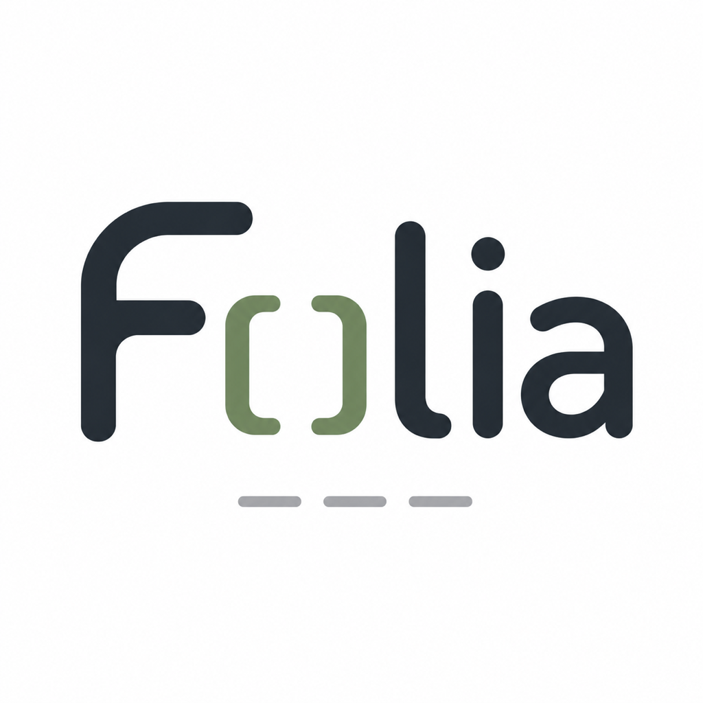

<p align="center">
  
</p>

# Folia

一个面向知识工作者的 Markdown 阅读与 Word 导出工具。

稳定预览包含 HTML 表格的 Markdown 文档，并支持 Word 纸张预览与导出。

## 官方网站

- 官网：[https://cat-xierluo.github.io/personal-site/folia/](https://cat-xierluo.github.io/personal-site/folia/)
- 源码：[https://github.com/cat-xierluo/Folia](https://github.com/cat-xierluo/Folia)

## 下载与安装

普通用户建议直接从 [GitHub Releases](https://github.com/cat-xierluo/Folia/releases/latest) 下载最新版本。

- macOS Apple Silicon：下载带 `aarch64` / `arm64` 字样的 `.dmg`
- macOS Intel：下载带 `x64` / `x86_64` 字样的 `.dmg`
- Windows：下载 `.exe` 或 `.msi` 安装包

安装后 Folia 会默认检查更新，也可以在“设置 / 关于”中手动检查或关闭自动检查。

### macOS 首次运行

当前版本尚未做 Apple Developer 公证。如果 macOS 提示“无法验证开发者”或“已损坏”，请先把 `Folia.app` 拖到“应用程序”，然后在终端执行一次：

```bash
xattr -dr com.apple.quarantine /Applications/Folia.app
open /Applications/Folia.app
```

如果你把应用放在其他位置，请把命令里的 `/Applications/Folia.app` 换成实际路径。这个命令只应对你信任来源的应用执行。

## 功能

- 打开 `.md` / `.markdown` / `.html` 文件（对话框或拖拽）
- 普通 Markdown 默认所见即所得编辑，保留源码模式 fallback
- 原生 HTML 表格文档自动进入稳定阅读预览，完整渲染合并单元格等复杂结构，并可一键进入源码编辑
- HTML 文件可手动进入演示模式，在隔离视图中运行演示脚本并支持常见翻页操作
- 按需打开 Word 多页纸张预览，支持预设选择、自定义 JSON 预设导入和 `.docx` 导出
- 按需打开 HTML 预览面板，支持复制到公众号编辑器、内联样式 HTML 导出、内置主题预设和自定义 CSS 槽位
- 浮动文档大纲（TOC），默认弱显示，hover 展开，可固定并点击跳转
- 保存 / 另存为
- 自动检查更新默认开启，也可在设置 / 关于中手动检查或关闭
- 安全处理：Vditor 内置 XSS 过滤（sanitize: true）

## 富媒体支持

v0.4.7 起，Folia 把富媒体内容（mermaid / SVG / 图片）从「各 surface 局部补丁」收口到统一渲染契约（DEC-119 / DEC-120 / DEC-121），跨主编辑器、HTML 预览面板与 Word 纸张预览共享 `RenderCoordinator` 的稳定 artifact，不再出现「主 IR 含 SVG、Word 预览 svg=0」的分叉。

当前稳定支持：

- **自渲染围栏**：mermaid / flowchart / sequence / echarts / math 等 Vditor 自渲染代码围栏在主 IR、HTML 预览和 Word 预览均按同一 generation 完成契约渲染，5s 软超时回退为 diagnostics 占位。
- **内联 SVG**：多行 / 复杂 defs + marker + clipPath + use + style + foreignObject 一律经过危险属性清洗（`<script>`、onload、js 协议等），保留可识别的矢量图形在三条 surface 同步显示。
- **本地图片**：PNG / JPEG / WebP / GIF / AVIF 等本地相对路径图片。在主编辑器粘贴 / 拖入相对路径图片时，`WysiwygEditorPane` 的 `input()` 路径通过 `resolveLocalImages` 即时解析为 blob/object URL，无需重开文档；v0.4.7 起 HTTPS 图片也走通 CSP（DEC-116）。
- **跨 surface 一致性**：主编辑器 IR、HTML 预览输出与 Word 纸张预览共享 `RenderCoordinator.renderMarkdownArtifact` 的稳定 artifact，避免单独 surface 局部修复造成的分叉。

更完整的架构说明（generation 单调递增、AbortSignal、Mermaid 终态等待等）见 [docs/ARCHITECTURE.md](./docs/ARCHITECTURE.md) 中「富媒体统一渲染管线」一章；占位与降级视觉约定（加载中 / 缺失 / 损坏 / 阻止 / 超时）见 [docs/DESIGN.md](./docs/DESIGN.md) §13 富媒体资源状态。

## 富媒体开发与测试

富媒体相关代码与测试集中在以下位置，方便开发者按 surface 或按异常路径快速检索：

- **fixture 集合**：[`fixtures/rich-media/`](./fixtures/rich-media/)（13 个 Markdown 场景 + 7 个 1×1 资产，含 Unicode 路径、危险 SVG 属性、HTTP/HTTPS 受限、双 Mermaid、缺失 / 损坏图片等异常样本）。`fixtures/rich-media/README.md` 列出所有 fixture 的预期行为。
- **Playwright 矩阵**：
  - [`e2e/rich-media-cross-surface.spec.ts`](./e2e/rich-media-cross-surface.spec.ts) — 把 2026-07-12 真实生产包探针升级为正式门禁，断言同一份双 Mermaid 文档在主 IR / HTML 复制 / Word 预览三条 surface 同步出现 SVG。
  - [`e2e/rich-media-fixture-matrix.spec.ts`](./e2e/rich-media-fixture-matrix.spec.ts) — 跨 13 个 fixture 跑端到端矩阵，断言每条 surface 至少满足期望的 IR DOM 探针。
- **CI 自动跑**：`.github/workflows/ci.yml` 新增 `playwright` job，把富媒体矩阵纳入每次 PR 的门禁，不依赖本地 Tauri dev 环境。
- **受管图片策略（DEC-121）**：`src/services/imageAssetService.ts` 提供 sha-256 同内容去重 + `sanitizeFileName` / `resolveAssetFileName` 纯函数 + `ImageAssetStore` pending ↔ persisted 状态机。用户粘贴 / 拖入 / 选择图片时默认走 `<doc>.assets/` 目录，Markdown 用相对路径引用，重复内容自动去重。
- **统一渲染入口（DEC-120）**：`src/services/renderCoordinator.ts` 暴露 `createRenderCoordinator()` 工厂与 `renderMarkdownArtifact(source, options)` 契约，被 `wordPreviewArtifactService` / `WechatPreviewPane` / `WordPaperPreviewPane` 共同消费。

补充验证：

```bash
npm run test         # vitest（含 imageAssetService / renderCoordinator 等红→绿测试）
npm run test:e2e     # Playwright（含 rich-media-* 矩阵）
npm run typecheck    # 类型检查
```

## 已知限制

DEC-119 富媒体统一渲染与资源治理当前状态：**🟡 大部分落地**（Phase 0–4 前端已合并并接入 3 个 surface；Rust fs 落盘 + 真实桌面验证仍待办）。当前明确未覆盖的范围：

- **Rust 侧资产落盘**：`imageAssetService` 的 pending ↔ persisted state machine 与 object URL 切换已可用，3 个 surface（主编辑器 / HTML 预览 / Word 预览）都通过 MediaPlaceholder 显示失败占位；但实际 fs 落盘仍依赖后续 Rust 改动（`protocol-asset` feature + persisted-scope）；当前新粘贴 / 拖入的图片在重启会话后会回到 pending 状态。
- **真实桌面端验证**：macOS WKWebView 与 Windows WebView2 的富媒体回归依赖 `release.yml` 的本地打包产物，不在 GitHub Actions 的 Playwright job 内跑。详见下方「桌面端真机 E2E（CDP）」段落。
- **Vditor toolbar 图片按钮**：Wave-1 W1 已通过 `ImageAssetStoreProvider` + Toolbar 自定义按钮（`CustomEvent('folia:toolbar-insert-image')`）+ Wave-3 W8 WysiwygEditorPane event delegation 接通，文件选择对话框在非 Tauri 环境直接禁用；完全恢复 Vditor 内置 toolbar 仍属后续 PR。

完整路线图与阶段进度见 [docs/ROADMAP.md](./docs/ROADMAP.md)「进度日志」中 2026-07-18 / 2026-07-16 条目。

## 快捷键

快捷键以 `（Cmd+…）` 后缀直接写在工具栏按钮的 hover `title` 中，中 / 英 / 日三语同步，鼠标悬停即可看到。设置页不再有独立的"快捷键"Tab。

| 动作 | macOS |
|------|-------|
| 打开文件 | `Cmd+O` |
| 保存 | `Cmd+S` |
| 另存为 | `Cmd+Shift+S` |
| 切换源码编辑 | `Cmd+Alt+S` |
| 切换 Word 纸张预览 | `Cmd+Alt+P` |
| 切换 HTML 预览 | `Cmd+Alt+M` |
| 打开设置 | `Cmd+,` |
| 导出 Word（预览面板内） | `Cmd+Shift+E` |

在 Windows / Linux 上把 `Cmd` 替换为 `Ctrl` 即可（快捷键监听器同时识别 `metaKey` 与 `ctrlKey`）。

## 技术栈

- Tauri v2
- React 19 + TypeScript
- Vite 8
- Vditor.preview()（Lute 引擎 + 代码高亮 / Mermaid / KaTeX）
- CodeMirror 6

## 作者

**杨卫薪律师** - 专注于技术类纠纷领域，包括知识产权、数据与 AI 相关争议，同时长期关注 AI 技术在法律实务、知识管理和专业写作中的应用。

Folia 是我在法律文档处理和 AI 协作实践中沉淀出来的轻量桌面工具：重点解决 Markdown 文档阅读、复杂 HTML 表格稳定预览，以及导出 Word 前的版式确认。

- GitHub: [cat-xierluo](https://github.com/cat-xierluo)
- 个人主页：[cat-xierluo.github.io/personal-site](https://cat-xierluo.github.io/personal-site/)
- 微信：`ywxlaw`

<p>
  
</p>

## 开发环境

本地开发需要先安装：

- Node.js 与 npm
- Rust stable toolchain
- macOS 构建还需要 Xcode 或 Xcode Command Line Tools

Tauri CLI 已作为项目开发依赖安装，不需要额外全局安装。更完整的系统依赖可参考 [Tauri 官方前置条件](https://v2.tauri.app/start/prerequisites/)。

启动桌面开发模式：

```bash
npm install
npm run tauri dev
```

只调试前端页面时，也可以运行：

```bash
npm run dev
```

常用验证命令：

```bash
npm test
npm run lint
npm run typecheck
```

### 桌面端真机 E2E（CDP）

`e2e/` 下的 Playwright 用例跑的是 Vite dev server 上的浏览器路径，**不连真实 Tauri WebView**。macOS WKWebView 与 Chromium 在键盘修饰键、IME、字体回退、滚动惯性、Tauri IPC、Finder 拖放等方面偶发差异，只有桌面端生产包才暴露。

为此提供 `scripts/etv-folia.mjs`（ISS-161）：通过 Playwright `connectOverCDP` 直连已启的 `tauri dev` 实例，复用其 WKWebView 跑真实桌面端断言。

```bash
# 终端 A：启动带 CDP 端口的 Tauri 桌面开发模式
npm run etv:dev

# 终端 B：等 WebView 出现后跑端到端验证（3 个场景）
npm run etv:run
# 仅跑指定场景：node scripts/etv-folia.mjs a   # / b / c
```

**macOS 限定**：当前仅 macOS WKWebView 通过 `WEBKIT_INSPECTOR_SERVER=127.0.0.1:9222` 暴露 CDP；Linux（GTK WebKit）/ Windows（WebView2）需用对应环境变量。**不进 GitHub Actions**：CI runner 上 WKWebView 跑不动，由开发者本地复测真实桌面端行为。

## 构建

只验证前端构建：

```bash
npm run build
```

本地打包桌面应用：

```bash
npm run tauri:build:local
```

构建产物通常位于 `src-tauri/target/release/bundle/`。

## 贡献

欢迎通过 Issue / Pull Request 参与 Folia。贡献流程与规范见 [CONTRIBUTING.md](./CONTRIBUTING.md)。

## 许可

Apache License 2.0
