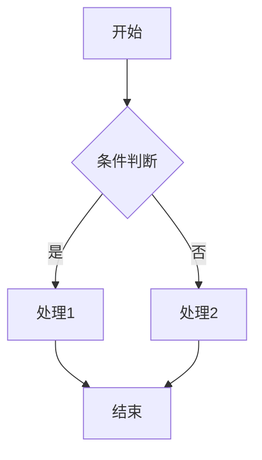
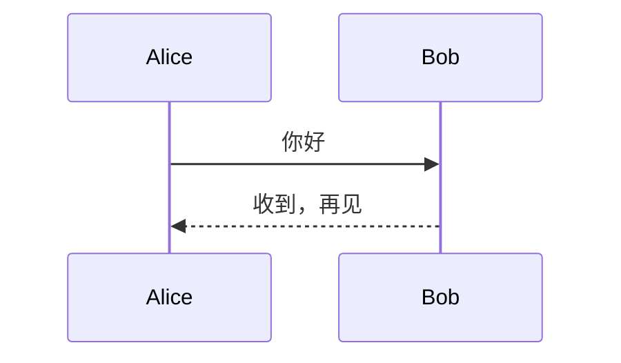

# Folia 富媒体验证文档（Smoke Demo）

> DEC-119 / DEC-120 / DEC-121 富媒体统一渲染治理效果的综合 smoke 验证文档。
> 用途：拖入 folia 后逐节对照「✅ 应该看到」，快速确认主编辑器 / Word 预览 / HTML 复制跨 surface 渲染正常。
> 真实桌面验证（§9.8）的默认入口；自动化 Playwright 矩阵见 `e2e/rich-media-*.spec.ts`。

## 一、Mermaid 流程图（验证 foreignObject 节点文字）

DEC-119 核心修复 + sanitize foreignObject 修复。修复前 HTML 复制 / Word 预览会是 `graph TD` 源码且节点文字丢失（有框无字）。



✅ 应该看到：
- 主编辑器：蓝框流程图，节点文字「开始」「条件判断」「处理1」「处理2」「结束」清晰可见
- Word 预览（Cmd+Alt+P）：同样的流程图（不是 `graph TD` 文字）
- HTML 预览复制粘贴：含完整 SVG 图

## 二、Mermaid 时序图



✅ 应该看到：两个参与者竖线 + 箭头 + 「你好」「收到，再见」文字。

## 三、多行内联 SVG

DEC-112 / DEC-114 SVG 重组修复。多行 SVG 不应被截断或留白条。

<svg xmlns="http://www.w3.org/2000/svg" width="240" height="60" viewBox="0 0 240 60">
  <rect x="0" y="0" width="240" height="60" fill="#4f46e5" rx="8" />
  <text x="120" y="36" text-anchor="middle" font-family="sans-serif" font-size="16" fill="#ffffff">
    内联 SVG 标题
  </text>
</svg>

✅ 应该看到：紫色圆角矩形 + 白字「内联 SVG 标题」，图后方无白色残留条。

## 四、HTTPS 图片（DEC-116 CSP 修复）

DEC-116 修复前 HTTPS 图片（含 WebP）被 CSP 阻止不显示。


✅ 应该看到：一张科技电路板图（不是空白）。如果空白，说明 HTTPS CSP 回归。

## 五、Data URI 图片

PNG data URI（WKWebView / Chromium 通用支持）：


✅ 应该看到：一个绿色方块。

> ⚠️ 已知限制：`data:image/svg+xml;base64,...` 在 `` 中，macOS WKWebView 出于安全（SVG 可含 script）默认不渲染，Chromium 可正常显示。folia 的 CSP `img-src` 与 `localImageResolver` 均允许 `data:`，此为 WebView 内核层差异，非 folia bug。需要内联矢量图时用第三节的多行 SVG 块（经 sanitize 安全清洗）。

## 六、数学公式（KaTeX）

行内公式 $E = mc^2$ 与块级公式：

$$
\int_{0}^{\infty} e^{-x^2} dx = \frac{\sqrt{\pi}}{2}
$$

✅ 应该看到：行内「E = mc²」上标正确；块级公式渲染成数学符号（不是 `$...$` 源码）。

## 七、代码块高亮

```typescript
function greet(name: string): string {
  return `Hello, ${name}!`;
}
console.log(greet('Folia'));
```

✅ 应该看到：语法高亮（关键字 function / string 等不同颜色），复制按钮。

## 八、表格

| Surface | 渲染形式 | 验证点 |
|---------|----------|--------|
| 主编辑器 IR | 矢量 SVG | 节点文字可见 |
| HTML 预览 | 矢量 SVG | 复制含 SVG |
| Word 预览 | 矢量 SVG | 非 graph TD 源码 |

✅ 应该看到：对齐的表格，表头加粗。

---

## 验证步骤

1. 把本文件拖入 folia 窗口（或 Cmd+O 打开 `fixtures/rich-media/demo.md`）
2. 逐节对照「✅ 应该看到」
3. 重点：Cmd+Alt+P 开 Word 预览，看 mermaid 是否成图（DEC-119 核心修复）
4. 开 HTML 预览，点复制按钮，粘贴到备忘录，看是否含 mermaid SVG

## 自动化

本文件的跨 surface 一致性由以下 Playwright spec 在 Chromium CI 守护：
- `e2e/rich-media-cross-surface.spec.ts`（HTML 复制 / Word 预览含 SVG）
- `e2e/mermaid-fidelity.spec.ts`（节点文字 / 像素非空 / sanitize）
- `e2e/rich-media-fixture-matrix.spec.ts`（13 个 fixture 端到端就绪）
