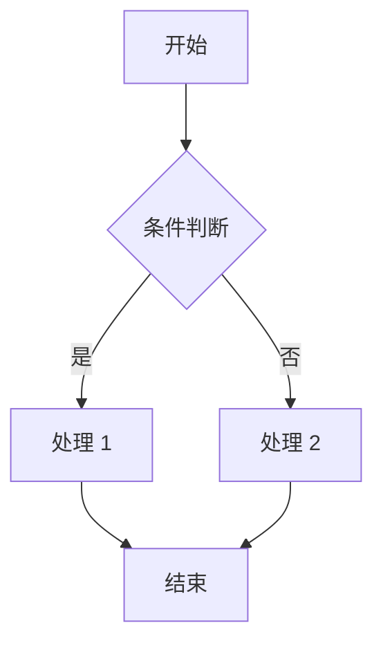
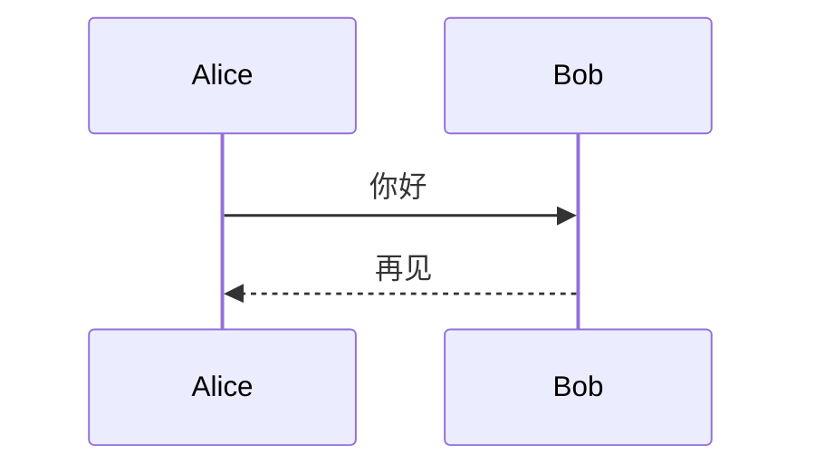

# Double Mermaid Fixture

用于验证同一文档内多块 Mermaid 围栏的并发完成与全 surface 渲染。

## 围栏 1：flowchart

```mermaid
graph TD
  A[开始] --> B{条件判断}
  B -->|是| C[处理 1]
  B -->|否| D[处理 2]
  C --> E[结束]
  D --> E
```

## 围栏 2：sequence

```mermaid
sequenceDiagram
  participant Alice
  participant Bob
  Alice->>Bob: 你好
  Bob-->>Alice: 再见
```

文档结束。